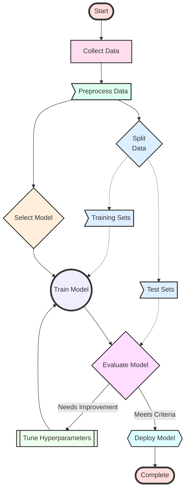

# Machine Learning

Our goal in machine learning is to extract a **relationship** from data.
What distinguishes a machine learning algorithm from a non-machine-learning algorithm, such as a program that controls traffic lights, is its ability to **adapt** its behaviors to new input. And this adaptation, which seems to have no human intervention, occasionally leads to the impression that the machine is actually **learning**. However, underneath the machine learning model, this adaptation of behaviors is as rigid as every bit of machine instructions that are programmed by humans. 

## Terms and Their Relationship

### Model
The outcome of a machine learning algorithm is called machine learning model, which can be considered as a **function F**, which outputs certain results, when given the input.

### terms w.r.t flow

#### input
- data set
  - sample/instance
    - attribute/feature attribute value
  - attribute space / sample space / input space
    - dimensionality

#### learn
- training data
  - training sample
  - training set
- training/learing

#### output (model)
- hypothesis (prediction?)
- ground-truth
  - latent space
- example = sample + *label*(info about the result)
  - label space / output space
- **Supervised Learning** (exits *label*)
  - predicting discrete values: **Classification**
    - binary classification: T/F
      - positive class(True)
      - negative class(False)
    - multi-class classification
  - predicting continuous values: **Regression**
    - linear regression
- **Unsupervised Learning** (no *label*)
  - **Clustering**
    - cluster (reveal some hidden classifications or rules we din't know)

#### verify
- testing
  - testing sample
- **generaliztion**: fitting the new samples
  - if
    - the sample space follows some underlying *distribution*, every sample we get is *independent and identically distributed* (i.e. `i.i.d`)
  - then
    - this ability grow with the size of the training samples

## The Big Picture

### general workflow
[sklearn-datacamp cheatsheet](https://images.datacamp.com/image/upload/v1676302389/Marketing/Blog/Scikit-Learn_Cheat_Sheet.pdf)

#### choice of Model
[SAS cheatsheet](https://blogs.sas.com/content/subconsciousmusings/2020/12/09/machine-learning-algorithm-use/)
[sklearn cheatsheet](https://scikit-learn.org/stable/tutorial/machine_learning_map/index.html)
[datacamp cheatsheet](https://s3.amazonaws.com/assets.datacamp.com/email/other/ML+Cheat+Sheet_2.pdf)
[azure cheatsheet](https://learn.microsoft.com/en-us/azure/machine-learning/algorithm-cheat-sheet?view=azureml-api-1)

